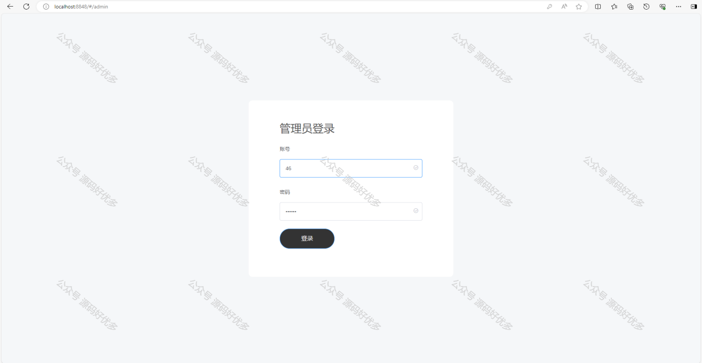

 
## 查看主页获取源码

### 一、作品包含

源码+数据库+设计文档万字+PPT+全套环境和工具资源+部署教程

### 二、项目技术

前端技术：Html、Css、Js、Vue、Element-ui

数据库：MySQL

后端技术：Java、Spring Boot、MyBatis

  

### 三、运行环境

开发工具：IDEA

数据库：MySQL8.0

数据库管理工具：Navicat10以上版本

环境配置软件： JDK1.8+Maven3.6.3

前端Nodejs：14

### 四、项目介绍
项目编号：springbootA188

随着互联网技术的不断发展和校园生活的多样化需求，校园跑腿系统应运而生。该系统旨在为大学生提供一个便捷的在线服务平台，解决校园内学生因时间紧张、事务繁忙而无法亲自处理的一些小事，如取快递、代购物品、代办事务等，从而提高校园生活的便利性，促进校园内的互助合作氛围，同时培养学生的创业精神和实践能力。

前台用户功能：首页、任务管理、订单管理、公告管理、评价管理、个人中心。

后台管理员的功能：首页、学校管理、用户管理、任务管理、评价管理、公告管理。

### 五、运行截图

  

